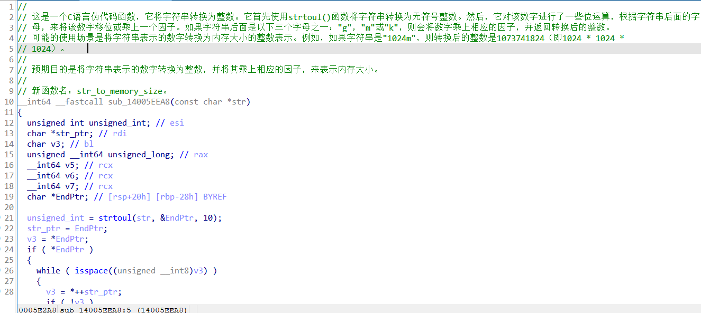

# Gepetto-ChatGPT

[JusticeRage/Gepetto](https://github.com/JusticeRage/Gepetto/) 的修改版本

## 特性

- 使用 text-davinci-002-render 模型

  与原项目不同的是 这个脚本使用ChatGPT的"text-davinci-002-render" 模型来进行代码分析
- 减少API费用

  ChatGPT暂时处在beta阶段 不收取费用 原项目使用的davinci-003模型每次API请求会按照Token数量收费 但是ChatGPT在用户高峰期并不稳定
- 增加对对长对话的支持 以分析更长的函数

  ChatGPT的Token数量限制更宽 可以分析更长的函数 返回更多的分析结果

- 分析结果增加中文支持

- 使用selenium来进行认证，代码来自[LanLan69/easyChatGPT](https://github.com/LanLan69/easyChatGPT)
- 由于Windows7不支持python3.9，无法使用`pypasser`，所以加了一个`solve_recaptcha`选项以手动点击验证码

